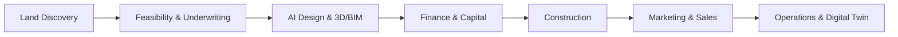
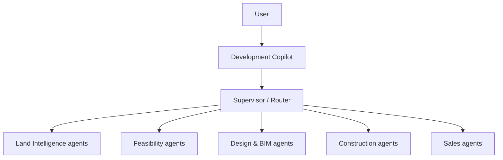

# Praxos — Real Estate Development OS

> An AI-powered operating system for the **complete real estate development lifecycle** — from finding land to designing, financing, building, selling, and operating the finished asset.

[](https://www.python.org/)
[](https://fastapi.tiangolo.com/)
[](https://docs.pydantic.dev/)
[](https://nextjs.org/)
[](https://www.typescriptlang.org/)
[](https://postgis.net/)
[](https://www.terraform.io/)
[](https://www.docker.com/)
[](https://helm.sh/)
[](https://github.com/features/actions)
[](https://aws.amazon.com/)
[](https://modelcontextprotocol.io/)

---

Praxos is being built to answer one deceptively simple question:

> ### “What should I build on this land?”

…and then to help execute the entire answer — evaluating the parcel, testing feasibility, designing the buildings in 3D/BIM, modeling the finances, managing construction, selling the units, and operating the completed property — inside one connected, AI-native environment.

It is **not** just a property-search app, an AI real estate chatbot, or a BIM tool. It is the *operating system* that ties the whole development lifecycle together, keeping a continuous **digital thread** from raw parcel to occupied building.

## Table of contents

- [What Praxos does](#what-praxos-does)
- [The developer's question, answered progressively](#the-developers-question-answered-progressively)
- [Architecture at a glance](#architecture-at-a-glance)
- [AI agent architecture](#ai-agent-architecture)
- [⭐ Engineering & delivery model (the differentiator)](#-engineering--delivery-model-the-differentiator)
- [Technology stack](#technology-stack)
- [Repository layout](#repository-layout)
- [Getting started](#getting-started)
- [Status & roadmap](#status--roadmap)
- [Documentation](#documentation)
- [About](#about)

## What Praxos does

The platform is organized around eight product domains, each preserving structured data that feeds the next stage of the lifecycle:

| Domain | What it delivers |
|---|---|
| **Land Intelligence** | Discover and rank parcels using GIS, zoning, ownership, utilities, flood/wetland/topography constraints, and comparable sales. |
| **Development Feasibility** | Zoning/density/site-capacity analysis, unit-mix planning, cost estimates, pro forma, ROI/IRR/equity multiple, sensitivity and risk scoring → *develop / negotiate / redesign / hold / pass*. |
| **AI Design Studio** | Conversational site plans, floor plans, and architectural concepts with cost-aware, parametric design changes. |
| **BIM & Digital Twin** | Structured building object model, IFC/Revit integration, model-to-cost/schedule links, and an operational digital twin. |
| **Finance & Capital** | Capital-stack modeling, development budgets, draws, cash flow, forecasting, and investor reporting. |
| **Construction Management** | Schedules, bids, procurement, RFIs, submittals, change orders, daily logs, inspections, and closeout. |
| **Sales & AI Agent** | Listings, AI property search, CRM, lead qualification, tours, offers, and transactions. |
| **Property Operations** | Warranty, HOA, maintenance, tenant/rental management, and digital-twin access over the asset's life. |

## The developer's question, answered progressively



A single parcel identified during acquisition stays connected to its feasibility study, design, BIM objects, budget, schedule, construction activity, sale, and operational history — that continuity is the **digital thread** at the core of the platform.

## Architecture at a glance

Praxos is designed as an **AI-native, domain-oriented, API-first** platform with authoritative logic in deterministic services (AI orchestrates; it does not become the system of record).

```text
┌───────────────────────────────────────────────────────────┐
│  EXPERIENCE   Developer · Design Studio · Contractor ·      │
│               Sales · Buyer · Operations portals            │
├───────────────────────────────────────────────────────────┤
│  API / EDGE   API Gateway · Auth · Rate limits · WS/SSE     │
├──────────────────────────────┬────────────────────────────┤
│  APPLICATION SERVICES         │   AI LAYER                   │
│  Project · Land · Feasibility │   Development Copilot        │
│  Design · BIM · Finance       │◄─►Supervisor + domain agents │
│  Construction · Sales · Ops   │   AI Gateway · MCP Gateway   │
├──────────────────────────────┴────────────────────────────┤
│  DATA   PostgreSQL · PostGIS · S3 · Redis · Vector/Search · │
│         Event store / audit · BIM & 3D asset storage        │
└───────────────────────────────────────────────────────────┘
```

Guiding principles: domain-oriented, AI-native (not AI-dependent), human-in-the-loop for regulated decisions, structured-data-first, event-driven, API-first, multi-tenant by design, and a preserved digital thread. Full detail in [`docs/PROJECT_ARCHITECTURE.md`](docs/PROJECT_ARCHITECTURE.md).

## AI agent architecture

Users interact with a single **Development Copilot**, which routes work to supervisor and domain agents that plan, call approved tools, validate results, and request human approval for high-impact actions.



Agents never touch production databases directly — they act through APIs and a governed **MCP tool gateway**, with tool allowlists, tenant-aware retrieval, output validation, and an audit trail for every action.

## ⭐ Engineering & delivery model (the differentiator)

Beyond the product, Praxos is built with a **governed, multi-agent software engineering operating model** — the kind of role separation, boundary enforcement, and delivery discipline you'd expect from a mature platform team, applied to AI-assisted development.

- **22 specialized engineering agents** (`.github/agents/*.agent.md`) — Product Owner, Architect, Backend, Frontend, Database, Platform, QA, Security, SRE, and more — each with explicitly **owned and forbidden paths**.
- **Machine-enforced role boundaries** — a runtime `PreToolUse` hook ([`.github/hooks/`](.github/hooks/)) *hard-blocks* an agent from editing files outside its scope, backed by a manifest (`governance/agent-boundaries.yaml`) and a CI validator.
- **Reusable skills** ([`.github/skills/`](.github/skills/)) — versioned playbooks (e.g. professional FastAPI service standards, CI/CD pipeline design) that keep implementation consistent across agents.
- **Architecture Decision Records** ([`docs/adr/`](docs/adr/)) — durable, reviewed records for consequential decisions.
- **Structured handoffs** — cross-role work moves through a typed contract (`contracts/handoffs/`) instead of scope creep.
- **Cost-aware LLM routing** — agents are assigned to premium/standard/economy model tiers to balance capability against spend.
- **CI/CD discipline** — dev deploys automatically (build → AWS ECR → Helm to Kubernetes); production is a manual, two-stage, reviewer-gated release.

> In short: the repository encodes *how* a disciplined team builds software, not just *what* the product is.

## Technology stack

| Area | Technology |
|---|---|
| Web | Next.js + TypeScript + Tailwind |
| Web 3D | React Three Fiber / Three.js · glTF / GLB |
| Backend | Python + FastAPI + Pydantic v2 |
| AI orchestration | LangGraph (or equivalent) · provider-neutral AI gateway |
| Agent tools | MCP + internal APIs |
| Database | PostgreSQL |
| Geospatial | PostGIS |
| Retrieval | PostgreSQL FTS + pgvector |
| Cache | Redis |
| Object storage | Amazon S3 |
| Events / queue | Amazon EventBridge · SQS |
| BIM | IFC + Revit / Autodesk integration |
| Containers / deploy | Docker · Helm · Kubernetes |
| Infrastructure as code | Terraform |
| Observability | OpenTelemetry + CloudWatch |
| CI/CD | GitHub Actions |

Technology choices are kept replaceable behind interfaces where practical.

## Repository layout

```text
.
├── backend/            # FastAPI service (domain, api/v1, tests) — the MVP land slice lives here
├── frontend/           # Next.js application (in progress)
├── contracts/          # Shared contracts: OpenAPI + cross-role handoff schemas
├── governance/         # agent-boundaries.yaml — machine-readable role ownership manifest
├── docs/               # Product vision, PROJECT_ARCHITECTURE.md, ADRs, agent/skill catalogs
└── .github/
    ├── agents/         # 22 role-scoped engineering agents
    ├── skills/         # Reusable engineering playbooks
    ├── instructions/   # Path-scoped coding standards
    ├── hooks/          # Runtime boundary-enforcement hook
    └── workflows/      # CI (incl. agent boundary checks)
```

## Getting started

The backend (land-intelligence MVP slice) runs today:

```bash
cd backend
python -m venv .venv
source .venv/bin/activate
pip install -r requirements.txt
uvicorn app.main:app --reload
```

Then explore the API:

- Interactive docs: `http://127.0.0.1:8000/docs`
- Health check: `GET /health`
- Score a parcel opportunity: `GET /api/v1/land/parcels/score?zoning=residential&utilities=available`
- Batch scoring: `POST /api/v1/land/parcels/score`

Run the tests:

```bash
cd backend
pytest
```

## Status & roadmap

Praxos is an actively evolving platform. Current focus and direction:

- **Implemented** — FastAPI backend foundation with a deterministic **land parcel scoring** API (GET/POST), health checks, tests, and the full engineering-governance system (agents, boundary enforcement, CI, skills, ADRs).
- **In progress** — frontend (Next.js) foundation and expanding the land/feasibility domains.
- **Planned (MVP target)** — the end-to-end slice: parcel → AI feasibility → AI design studio → floor plan → 3D building → cost estimate → development pro forma, coordinated by the Development Copilot.
- **Longer term** — BIM & digital twin, construction management, sales, and property operations, evolving toward the full lifecycle OS.

See [`docs/PROJECT_ARCHITECTURE.md`](docs/PROJECT_ARCHITECTURE.md) (§23–24) for the detailed MVP boundary and staged evolution.

## Documentation

- [Product vision](docs/README.md)
- [System architecture](docs/PROJECT_ARCHITECTURE.md)
- [Architecture Decision Records](docs/adr/)
- [Agent catalog](docs/AGENT_CATALOG.md) · [Skill catalog](docs/SKILL_CATALOG.md) · [Operating model](docs/OPERATING_MODEL.md)

## About

**Adeyinka Adedotun** — architect and builder of Praxos.

- LinkedIn: [adeyinka-adedotun](https://www.linkedin.com/in/adeyinka-adedotun)
- Email: [adedotunyinka10@gmail.com](mailto:adedotunyinka10@gmail.com)

> Praxos demonstrates end-to-end platform thinking: an ambitious, domain-rich product vision paired with disciplined, governed engineering execution — from deterministic APIs and clear architecture to enforced role boundaries and production-grade CI/CD.
